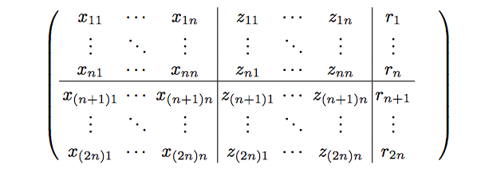
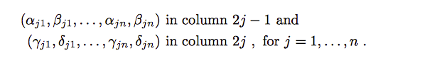

# Juqst: JUlia Quantum Simulator Toolbox

This is an old archive - almost all of the functionality (and a lot more besides) has been re-implemented as a Julia module which can be found at [https://github.com/rharper2/Juqst.jl](https://github.com/rharper2/Juqst.jl).

## Beginning of a quantum simulator toolbox, primarily written in the Julia Language

### Done:

* Implement the simulation of Stabiliser Circuits [Aaronson/Gottesman arXiv:quant-ph/0406196](http://arxiv.org/pdf/quant-ph/0406196)
* Implement ability to select an arbitrary Clifford group element [Koenig/Smolin arXiv:quant-ph/1406.2170](http://arxiv.org/abs/1406.2170)
* Implement the ability to decompose an arbitrary clifford unitary into a quantum circuit consistiting of hadamard, phase and two-qubit cnot gates.(Aaronson/Gottesman arXiv:quant-ph/0406196)
* Draw the quantum circuit resulting from the decomposition of the clifford/unitary
* Implement basic steps to rationalise the decomposed circuit
* Simple brute force method to determine smallest circuit possible (runs in approximately (n*n)^(n*n) time - probably only for 3 qubits or less, or people with a serious amount of spare time)
* Allow generation of a sub-group of Cliffords that are also a unitary 2-design [Cleve/Leung/Wang Near-linear constructions of exact unitary 2-designs arXiv:quant-ph/1501.04592](https://arxiv.org/abs/1501.04592)


### To do:

- document randomised benchmarking from arbitrary designs
- document random single noise channel generation

# To install

This has been updated to Julia 0.6.2.

The exampleNotebooks directory contains, suprisingly enough, some sample notebooks that show how to work this. They assume IJulia. The one that shows how to use the Stabiliser mechanisms and plotting functions is called "A stabiliser run through". It is probably worth running that one early.


# Sample use

## Stabiliser Circuits

    state = setup(number_ofQubits)

prepares the stabiliser state for the correct number of qubits in the |000..000> basis state

The state is represented internally as a matrix of the form:

</img>
Aaronson/Gottesman arXiv:quant-ph/0406196

Currently I am just using Int32 Arrays, although binary arrays would save space (if it ever becomes necessary).
Rows 1 to n of the tableau represent the destabiliser generators, rows n+1 to 2n represent the stabiliser generators. Each row is read
as follows: if the x<sub>ij</sub> and z<sub>ij</sub> are 1, the de/stabiliser is a Y, if they are both 0, its I otherwise its an X or Z depending on which one is set.
 
    output(state)

Prints the state in a human readable form. The states above the line are the 'destabiliser' state, below the line are the 'stabiliser' states. 

So in a 3 qubit system the initial state of |000> is coded as 

```
XII
IXI
IIX
---
ZII
IZI
IIZ
```

The following commands are defined

    hadamard(state,qubit)  # apply a hadamard to the relevant qubit
    phase(state,qubit)     # apply a phase gate to the relevant qubit
    cnot(state,control,target) # apply a controlled not from control qubit to target qubit

Output of the resultant state can be supressed by adding an extra false parameter

    hadamard(state,qubit,false) # hadamard as before, but supress output

**NOTE! that these commands alter the state passed into them. I have broken Julia convention which requires functions 
with side effects to be written thus - hadamard!(state,qubit), rather hadamard!(qubit) alters a globally defined variable, called state.**

## Arbitrary cliffords

(Koenig/Smolin arXiv:quant-ph/1406.2170)

The idea behind this paper is that we can implement a one-to-one mapping between the cliffords and an integer (plus a random phase string).

The mapping is as follows:

Koenig/Smolin arXiv:quant-ph/1406.2170</img>

We can generate the alpha,beta,gamma and delta via

   symplectic(i,n) # i = integer represting the clifford, n is the number of qubits

Which returns the nxn arrays (alpha->delta) coded as follows:

Koenig/Smolin arXiv:quant-ph/1406.2170</img>

More usefully these can be placed into a stabiliser tableau (that is the equivlent of passing the state |0000> through a gate that implements the unitary in question as follows:

    stabiliseSymp(symp) # where symp is the symplectic of the clifford generated.

e.g.

    state = stabiliseSymp(symplectic(23,4),3) # for the tableau of clifford '23' in a 4 qubit system - the final 3 sets versious sign bits.

Of course there are actually 4^n versions of of symplectic 23 (here n = 4), because of the different phases that we can have - this will be implemented shortly.

# Decomposing a tableau (such as clifford)

This will be made more general, but just now it decomposes an arbitrary clifford

    decompose(clifford_number, qubits)

    more generally, you can also decomposeState(state)

    Both the above have two additional parameters the first is supressOutput, defaults to false and the second is rationalise (default to true)
    Rationalise simply eliminates 4 phases in a row, two hadamards in a row or self cancelling cnots.

This prints out the elementary gates that would reconstruct the relevant clifford unitary.

The commands are stored as string in the vector commands
The commands are also stored as Julia code in the vector executeCommands (so you can for instance execute them to re-create the tableau)

# Draw the circuit

This is a bit more involved, just now I am using IJulia to provide the rich notebook needed to see the circuit.

To install IJulia, full instructions can be found here: https://github.com/JuliaLang/IJulia.jl. Note that if you haven't yet installed PyCall and Conda - you might want to consider going straight to Python 3 (at the time of writing it defaults to Python 2). Check out the Working with Python notebook in the exampleNotebook directory.


